

  

I build automations that people can trust with real data. At **CityGrill** I work on AI and BI automation: tools that change thousands of POS records only after a person approves the plan, assistants that answer questions straight from Power BI, and reports that run themselves. Through my own B2B company I build websites and web apps for clients, and I'm a student at the Faculty of Cybernetics, Statistics and Economic Informatics at ASE Bucharest.

I'm not tied to one stack. I pick up what the project needs: TypeScript and Python most days, DAX and SQL for data, C, C++ and Assembly from university.

  
  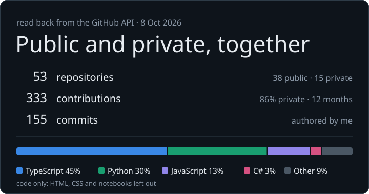

## What I build

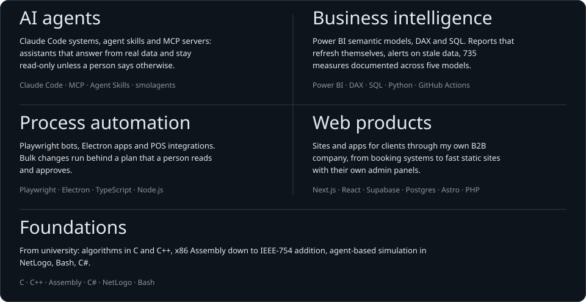

## Selected work

#### In production at CityGrill

These repositories are private. They're described by what they do; internal details stay internal.

  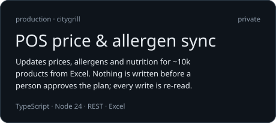
  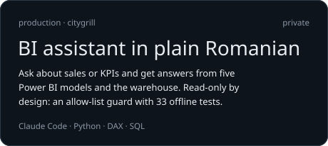

  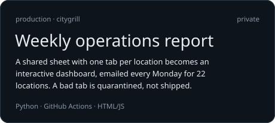
  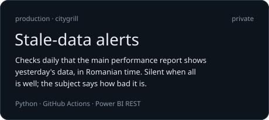

  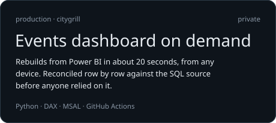
  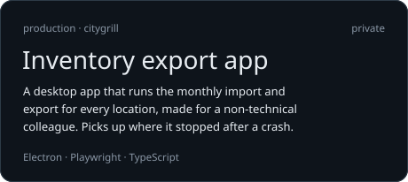

#### Open source

  <a href="https://github.com/AngelescuCiprian/aios-claude-code">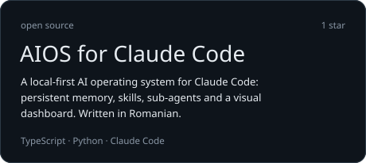</a>
  <a href="https://github.com/AngelescuCiprian/claude-skills">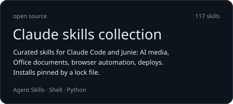</a>

  <a href="https://github.com/AngelescuCiprian/Script_BibliotecaAcademieiRomane">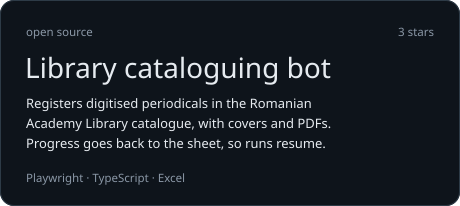</a>
  <a href="https://github.com/AngelescuCiprian/citygrill-competitor-scraper">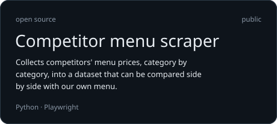</a>

#### Client work

  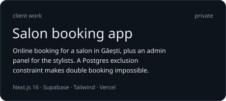
  <a href="https://bskmetaconstruct.ro">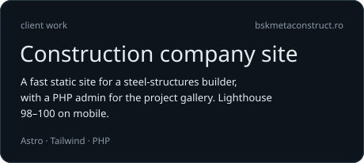</a>

Also: a landing page for [a beauty salon](https://github.com/AngelescuCiprian/Mood-Beauty), a [fact-sharing app](https://github.com/AngelescuCiprian/today-i-learned) in React and Supabase, and coursework from [x86 Assembly](https://github.com/AngelescuCiprian/Floating-Point-Addition-IEEE.754) to a [NetLogo simulation](https://github.com/AngelescuCiprian/Men-vs-Gorillas-NetLogo-Simulation).

## How I work

- **Nothing writes without a plan a person approved.** Bulk changes go validate → plan → approve → apply.
- **Proof comes from re-reading, not from a success response.** After a write, the source is read again and compared with the plan.
- **Quiet until something is wrong.** An alert that fires every day stops being read.
- **Reconcile before anyone relies on it.** A new data path is compared row by row with the old one before it replaces it.

  <a href="https://angelescu-ciprian.netlify.app/"><b>Portfolio</b></a> · Bucharest, Romania

Stats read from the GitHub API, private repositories included. Rebuild with <code>python scripts/build_assets.py --refresh</code>.

